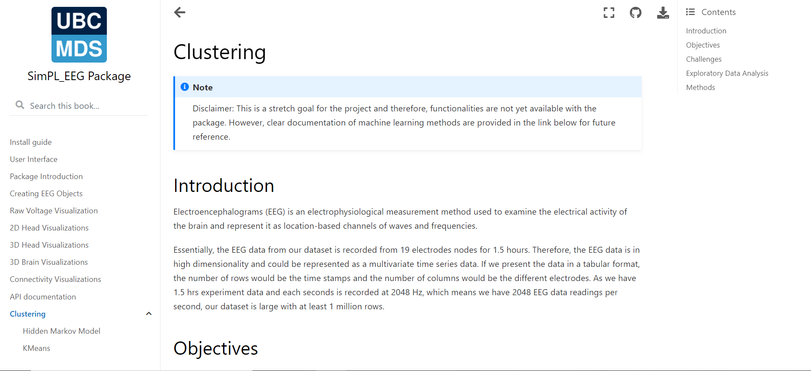

---
output:
  pdf_document: default
geometry: margin=2.5cm
urlcolor: blue
bibliography: References.bib
---

# DSCI 591: Capstone Project - Final Report for Sensing in Biomechanical Processes Lab (SimPL)

**Team members**: Matthew Pin, Mo Garoub, Sasha Babicki, Zhanyi (Yiki) Su

**Project mentor**: Joel Ostblom

**Date**: June 28, 2021

## 3.1. Executive Summary

The purpose of our project was to to help our partner, SimPL, visualize EEG data and understand the functional state of the brain after head injuries. In order to address SimPL's problem with limited EEG visualization methods, we developed a Python package to extend the functionality of existing Python EEG visualization tools. We also developed an interactive user interface for the package to provide access to the functionality for those who do not have experience with Python. Finally, we tried various clustering methods on the data in an attempt to potentially identify various brain states. We did not discover any significant findings with the clustering methods used, but we have documented our process in the hopes that the partner will continue where we left off. 

## 3.2 Introduction

Electroencephalograms (EEG) is an electrophysiological measurement method used to examine the electrical activity of the brain and represent it as location-based channels of waves and frequencies. EEG benefits from being inexpensive and unobtrusive, leading to its widespread use in diagnosing brain disorders such as epilepsy and brain damage from head injuries. EEG data is recorded with high dimensionality, so the use of visualizations is essential for the data to be easily interpreted by humans. The currently available options for visualizing EEG data often require the use of complicated packages and functionally is often limited.

Our partner SimPL is a research lab in the department of Mechanical Engineering at UBC which focuses on developing quantitative and sensitive methods to evaluate the electrophysiological changes after sport head injuries. The underlying mechanisms of brain dysfunction are not fully understood, in part because concussion and brain injuries are generally invisible. EEG technology has proven particularly useful for their research purposes.

Our team was approached to design novel solutions for simplifying and extending methods used to understand EEG data, including for researchers with a minimal programming background. Having multiple visualizations that are convenient to access and view simultaneously will allow for an intuitive understanding of the broad picture of brain function. Additionally, future iterations of our machine learning stretch goal could uncover patterns in the data which could not be determined based on visualization alone.

We decided on the following deliverables:

1) A Python package for generating advanced EEG visualizations. The package contains six different modules for visualizing EEG data, allowing the user to see the data from different viewpoints, each with their own unique benefits. The package is built in an editable way so that the partner may continue to develop and customize the functionality after the Capstone project is complete. 

2) An interactive web application to provide a user interface (UI) for the package. This allows users to explore the package's functionality in one place without needing to write any code.

In addition to our main delerviables, we had the following stretch goal:

1) Explore unsupervised machine learning methods to cluster and identify potential patterns in EEG data.

\newpage

## 3.3. Data Science Methods

The partner provided us with cleaned data from eight experiments. Each experiment has a folder containing a file with 1.5 hours of recorded EEG data, a settings file, and a list of impact times in matlab format. Our package divides the data into time steps called "epochs" based on a user's selection, and has the option to skip or average steps to reduce the volume of data to visualize.

The Python visualization package extends and simplifies the functionality of the open source library [MNE](https://mne.tools/stable/index.html) [@mne], which is designed for visualizing and analyzing human neurophysiological data (MEG, EEG, MRI, etc.). Custom visualizations were built with [Matplotlib](https://matplotlib.org/) [@matplotlib] and [Plotly](https://plotly.com/) [@plotly]. The functions in our package were developed to improve ease-of-use over using MNE, Matplotlib, and Plotly directly. Clear [documentation](https://ubc-mds.github.io/simpl_eeg_capstone/installation.html) was produced using [JupyterBook](https://jupyterbook.org/intro.html) [@jupyterbook] and the [code](https://github.com/UBC-MDS/simpl_eeg_capstone) is tested and documented to allow package functionality to be easily updated following the completion of the Capstone.

Multiple functions are available to allow the user to visualize the data from different perspectives depending on their specific needs. Methods vary based on their compatibility with the UI, rendering speed, and representation of dimensions and time. A summary of these characteristics is detailed below and will be discussed further in the Data Product and Results section. 

{ height=20% }

For the interactive user interface (UI) we used an open source framework called [Streamlit](https://streamlit.io/) which is designed for generating web applications from Python scripts. Streamlit benefits from being lightweight and requiring no front-end experience, which will facilitate ease of updating in the future. The downsides to Streamlit are reduced flexibility; namely incompatibility with some types of figures and limited style customization options. However, for the purposes of this project we believe that the simplicity and ease of maintenance outweighs the need for additional features.

Our team explored different unsupervised clustering methods to identify "brain states" over time, which are distinct temporal patterns of electrical activity within the 19 channel EEG data over fixed-length time sections. The expected outcome of this task is to separate the experiment data into clusters (i.e. chunks of EEG data) representing different brain states. One method we explored is KMeans clustering, which utilizes the [KMeans](https://scikit-learn.org/stable/modules/generated/sklearn.cluster.KMeans.html) model from [Scikit-learn](https://scikit-learn.org/stable/index.html) [@scikit-learn] to cluster data from each provided time period based on distance from the cluster centers. Another method we tried is the Hidden Markov model, which uses the GaussianHMM model from [hmmlearn](https://hmmlearn.readthedocs.io/en/latest/) to calculate the Gaussian distribution of the EEG data and creates a transmission probability matrix based on the transitions between brain states over time. For more details of each of the approaches, please refer to the [KMeans](https://ubc-mds.github.io/simpl_eeg_capstone/clustering_kmeans.html) and [HMM](https://ubc-mds.github.io/simpl_eeg_capstone/clustering_kmeans.html) notebooks in our documentation.

\newpage

## 3.4 Data Product and Results

### 3.4.1 Python Package

The `simpl_eeg` Python package is able to produce advanced and customizable visualizations for specified time ranges of EEG data. With the exception of the Raw voltage plot, each visualization can also be created as an animation to view changes over time. Plots can be exported as svg, png, or jpeg files and animations can be exported as html, mp4, or gif files. The following visualization types are available:

1) **Raw voltage plot** for visualizing raw voltage value changes over time for each node. Time is represented on the x-axis so it is not animated. This plot provides a view of the largest amount of data in a single image, making it well suited to assessing the broad picture of your data. 

{ height=25% }

2) **2D topographic head map** for visualizing a topographic heatmap of the voltage values mapped to a 2D model of a head. This allows the user to see where activity is occurring on the head, with the animation showing how voltage changes over time. One downside is that some distortion occurs when representing a 3D head in two dimensions. However, the quick render time, simplicity of the figure, and the view it provides of all nodes in a single 2D image make it one of the most useful visualizations in the package.  

{ height=25% }

\newpage

3) **3D head map** for visualizing a topographic heatmap of voltage values mapped to a 3D model of head. The 3D representation allows the user to see voltage changes on a spatially accurate representation of the head, which provides a solution to the distortion on the 2D head map. The figure can be freely rotated in order to examine the data from different angles. A major drawback of this function is that it is slower to render than the 2D head map. 

{ height=25% }

4) **3D brain map** for visualizing a topographic heatmap of interpolated voltage values mapped to their presumed position on a 3D model of a brain. This allows the user to view the presumed source of the voltage changes, making it possible to correlate EEG data with specific regions of the brain. MNE provides default calculations for the mapping which can be adjusted by the user.

{ height=18% }

\newpage

5) **Connectivity plot** for visualizing pairwise connectivity measurements such as correlation, envelope connectivity, spectral connectivity, and coherence between nodes for specified time ranges. This type of visualization is not available with other packages to our knowledge. It represents the connectivity measurements with colours and line size, which shows which nodes have similar patterns over time. 

{ height=20% }

6) **Connectivity Circle** for generating an alternative perspective for visualizing pairwise connectivity measurements. The connectivity plot is more useful for seeing the changes mapped directly on the head, whereas the connectivity circle represents the nodes in a circle. The connectivity circle allows you to select a specific number of highest magnitude connections, so it may assist in finding node connections for further inspection with the connectivity plot. 

{ height=20% }

Detailed instructions on how to use the package can be found in our [Jupyter book documentation](https://ubc-mds.github.io/simpl_eeg_capstone/installation.html). 

\newpage

### 3.4.2 User Interface

In addition to the package, we built an interactive web application to serve as a UI for the package. The UI requires no coding experience, provides the main visualizations all in one place, and can be launched using a single command. Intuitive widgets and entry fields allow for the adjustment of a selection of the most widely used options for each visualization type. Although the UI is a useful tool for exploring the package, it does not provide access to every customization option. We suggest that figures needing total customization control be produced with the package directly. 

### 3.4.2 Stretch goal

To assist the partner in exploring our progress and continuing the data clustering process after completion of the Capstone, we have created a Jupyter notebook file for each approach we have tried; namely `KMeans`, `Hidden Markov Model`, and `Other clustering methods`. An introduction to the clustering stretch goal and links to relevant documents can be found in the `Clustering` chapter of our [Jupyter book documentation](https://ubc-mds.github.io/simpl_eeg_capstone/clustering.html). Inside the notebooks, we outline reasoning behind the approach, provide a detailed workflow from data preprocessing and model fitting to the output visualization, and explore an interpretation for each approach. The notebooks serve as a good reference point for the partner to further explore clustering in the future. Additionally, we include a section called `Next steps` in some notebooks to let the partner know of potentially useful steps in finding the significant results they desire.

\newpage

## 3.5 Conclusions and Recommendations

Both main goals have been completed and the stretch goal has been partially completed. A full list of recommendations can be found in the [Product Enhancement Ideas GitHub issue](https://github.com/UBC-MDS/simpl_eeg_capstone/issues/142).

The package functionality allows for generation of all the figures laid out in our initial proposal with a variety of options available for fine-tuning and customization. Each figure has a unique combination of strengths and weaknesses which provide a variety of visualizations to choose from depending on the users needs. We recommend to the partner to improve the package by adding further functionality such as offering additional file type support. 

The Streamlit UI has an intuitive and uncluttered interface that enables straightforward generation of any of these figures and allows for tweaking of most of our visualization options. We recommend the partners update the UI to allow users to specify custom data file paths from within the interface. We also recommend deploying the application as a publicly hosted web application to allow for access without the installation of any local files; however, privacy and security of research data are potential hurdles in this process.

The stretch goal has been started but will require further development from the partner. Our progress so far has been exploring different unsupervised clustering methods. Our detailed notebooks provide a good overview of potentially useful pre-processing steps, available models, and outcome visualization methods for EEG clustering tasks. We recommend the partner continue the machine learning analysis from where we left off and apply their domain expertise to make necessary modifications to the workflow.

\newpage
## References
