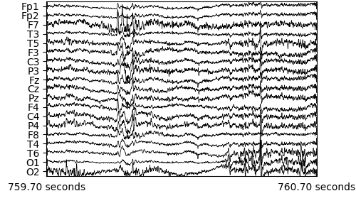
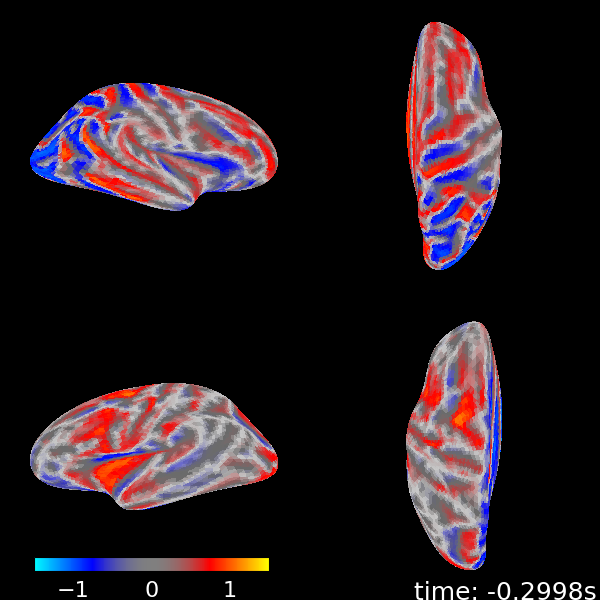

---
output:
  pdf_document: default
geometry: margin=2.5cm
urlcolor: blue
---

# DSCI 591: Capstone Project - Final Report for Sensing in Biomechanical Processes Lab (SimPL)

**Team members**: Matthew Pin, Mo Garoub, Sasha Babicki, Zhanyi (Yiki) Su

**Project mentor**: Joel Ostblom

**Date**: June 22, 2021

## 3.1. Executive Summary

Our partner SimPL is a research lab that explores research questions concerning the human brain. The purpose of our project was to to help them visualize EEG data and understand the functional state of the brain after sports-related head injuries. After learning about SimPL's problem with limited visualization methods, we proposed the following deliverables:

1) A Python package for generating advanced EEG visualizations

2) An interactive web app to provide a user interface for the package

Stretch Goal:

1) Explore unsupervised machine learning methods to cluster and identify potential patterns in EEG data

## 3.2 Introduction

Electroencephalograms (EEG) is an electrophysiological measurement method used to examine the electrical activity of the brain and represent it as location-based channels of waves and frequencies. EEG benefits from being inexpensive and unobtrusive, leading to its widespread use in diagnosing brain disorders such as epilepsy and brain damage from head injuries. EEG data is recorded with high dimensionality, so the use of visualizations is essential for the data to be easily interpreted by humans. Currently, the options for visualizing EEG data require the use of complicated packages or software and the functionally is often limited.

SimPL is a research lab in the department of Mechanical Engineering at UBC which focuses on developing quantitative and sensitive methods to evaluate the electrophysiological changes after sport head injuries. The underlying mechanisms of brain dysfunction are not fully understood, in part because concussion and brain injuries are generally invisible. EEG technology has proven particularly useful for their research purposes.

Our team was approached to design novel solutions and methods to simplify the process of extracting and visualizing the human brain state using EEG data. Our goal was to extend the number of visualizations available to researchers, including those with a minimal programming background. Making multiple visualizations convenient to access and view simultaneously will allow for an intuitive understanding of the broad picture of brain function. Additionally, future iterations of our machine learning stretch goal could uncover patterns in the data which could not be determined based on visualization alone.

{height=15% width=75%}

\newpage

## 3.3. Data Science Methods

The Python visualization package extends and simplifies the functionality of the open source library [MNE](https://mne.tools/stable/index.html), which is designed for visualizing and analyzing human neurophysiological data (MEG, EEG, MRI, etc.). Custom visualizations were built with [Matplotlib](https://matplotlib.org/) and [Plotly](https://plotly.com/). The functions in our package were developed to improve ease-of-use over using MNE, Matplotlib, and Plotly directly. Clear [documentation](https://ubc-mds.github.io/simpl_eeg_capstone/installation.html) was produced using [JupyterBook](https://jupyterbook.org/intro.html) and the [code](https://github.com/UBC-MDS/simpl_eeg_capstone) is tested and documented to allow package functionality to easily be updated following the completion of the Capstone.

Multiple visualization techniques were included in order to allow the data to be viewed from different perspectives. Visualization methods should be selected based on the user's specific needs. Different methods vary based on their compatibility with the UI, representation of dimensions (e.g. distortion due to representing a 3D image in 2 dimensions), rendering speed, and representation of time. A summary of these characteristics for each visualization is detailed below:

{ height=20% }

For the interactive user interface (UI) we used an open source framework called [Streamlit](https://streamlit.io/) which is designed for generating web applications from Python scripts. Streamlit benefits from being lightweight and requiring no front-end experience, which will facilitate ease of updating in the future. The downsides to Streamlit are reduced flexibility; namely incompatibility with some types of figures and limited style customization options. However, for the purposes of this project we believe that the simplicity and ease of maintenance outweighs the need for additional features.

Both KMeans and Hidden Markov model unsupervised clustering methods have been utilized with the goal of identifying multiple unique "brain states" in the data. In this context, "brain states" refers to a distinct temporal pattern of electrical activity within the 19 channel EEG data. The KMeans clustering method utilizes the [KMeans](https://scikit-learn.org/stable/modules/generated/sklearn.cluster.KMeans.html) model from [Scikit-learn](https://scikit-learn.org/stable/index.html) to cluster data from each provided time period based on distance from the cluster centers. The Hidden Markov model method uses the GaussianHMM model from [hmmlearn](https://hmmlearn.readthedocs.io/en/latest/) to calculate the Gaussian distribution of the EEG signals and creates a transmission probability matrix based on the transitions between "brain states" over time. Furthermore, we have also looked into expanding our analysis to methods beyond what we covered in the MDS curriculum such as Self Organizing Maps (SOM) to produce a lower dimensional representation of the clusters using neural network and K-means with Dynamic Time Warping (DTW) using `tslean` to visualize similarities between time series.

## 3.4 Data Product and Results

### 3.4.1 Python Package

The `simpl_eeg` Python package is able to produce advanced visualizations for specified time ranges of EEG data. The following visualization types are available:

\newpage

1) **Raw voltage plot** for visualizing raw voltage value changes over time for each node.

{ height=15% }

2) **2D topographic head map** for visualizing a topographic heatmap of the voltage values mapped to a 2D model of a skull.

{ height=20% }

3) **3D head map** for visualizing a topographic heatmap of voltage values mapped to a 3D model of skull.

{ height=20% }

\newpage

4) **3D brain map** for visualizing a topographic heatmap of interpolated voltage values mapped to their presumed position on a 3D model of a brain.

{ height=18% }

5) **Connectivity plot** for visualizing pairwise connectivity measurements between nodes for specified time ranges.

{ height=20% }

6) **Connectivity Circle** for generating an alternative perspective for visualizing pairwise connectivity measurements

{ height=20% }

With the exception of the Raw voltage plot, each visualization can be created as an animation to view changes over time or as a standalone plot. Detailed instructions on how to use the package can be found in our [documentation](https://ubc-mds.github.io/simpl_eeg_capstone/installation.html).

### 3.4.2 User Interface

In addition to the package we built an interactive web application to serve as a UI for the package. The UI requires no coding experience, and is made accessible by launching with a single command. It also has the benefit of providing all the main visualizations in one place, allowing for data to be easily examined from several different perspectives. Intuitive widgets and entry fields that allow for adjusting of the most widely used options in each package function make customization easy.

### 3.4.2 Stretch goal

Although we have tried different approaches for the stretch goal, due to the limited time allocated to the stretch goal we haven't discovered any significant findings yet. However, we do think it would be useful to document all approaches we have tried so far to serve the partner as a good reference point to continue to work on the stretch goal in the future. Hence, we have decided to create a Jupyter notebook file for each approaches to outline the workflow from data preprocessing, model fitting to output visualization for each approaches. We have also included a section called `Next steps` in some applicable notebooks to let the partner know that there are some next steps potentially useful in finding the significant results but we haven't had time to implement yet, such as using rolling means and sliding windows as feature engineering or including a customized visualization function for visualizing clustering outcome.

## 3.5 Conclusions and Recommendations

Both main goals have been completed and the stretch goal has been partially completed. A full list of recommendations can be found in the [Product Enhancement Ideas GitHub issue](https://github.com/UBC-MDS/simpl_eeg_capstone/issues/142).

The package functionality allows for generation of all the figures laid out in our initial proposal with a variety of options available for fine-tuning and customization for each visualization method. Each figure has a unique combination of strengths and weaknesses which provide unique options regardless of what the researcher desires. We recommend to the partner to improve the package by adding further functionality such as offering additional file type support. 

The Streamlit UI has an intuitive and uncluttered interface that enables straightforward generation of any of these figures and allows for tweaking of most of our visualization options. We recommend for the partner to update the UI to allow users to specify custom data file paths from within the interface. We also recommend deploying the application as a publically hosted web application to allow for access without the installation of any local files, however, privacy and security of research data are potential hurdles in this process.

The stretch goal has been started but will require further development from the partner. Our progress so far has been exploring different unsupervised clustering methods. Our detailed notebooks provide a good overview of potential useful pre-processing steps, available models and outcome visualization methods for EEG clustering tasks. We recommend the partner continue the machine learning analysis from where we left off, particularly with the SOM method which we deem to be the most promising. 

\newpage

## References

Asgari, Shadnaz PhD1,2; Adams, Hadie MD3; Kasprowicz, Magdalena PhD4; Czosnyka, Marek PhD3,5; Smielewski, Peter PhD3; Ercole, Ari MB BChir, PhD6 Feasibility of Hidden Markov Models for the Description of Time-Varying Physiologic State After Severe Traumatic Brain Injury, Critical Care Medicine: November 2019 - Volume 47 - Issue 11 - p e880-e885 doi: 10.1097/CCM.0000000000003966
