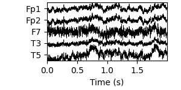

---
output:
  pdf_document: default
geometry: margin=2.5cm
urlcolor: blue
---

# DSCI 591: Capstone Project - Final Report for Sensing in Biomechanical Processes Lab (SimPL)

**Team members**: Matthew Pin, Mo Garoub, Sasha Babicki, Zhanyi (Yiki) Su

**Project mentor**: Joel Ostblom

**Date**: June 22, 2021

## 3.1. Executive Summary

The purpose of our project was to to help our partner, SimPL, visualize EEG data and understand the functional state of the brain after sports-related head injuries. After learning about SimPL's problem with limited visualization methods, we decided to develop a Python package to extend the functionality of existing Python EEG visualization tools. We also developed an interactive user interface for the package to provide access to the functionality for those who do not have experience with Python. Finally, we tried various clustering methods on the data in an attempt to potentially identify various brain states. 

## 3.2 Introduction

Electroencephalograms (EEG) is an electrophysiological measurement method used to examine the electrical activity of the brain and represent it as location-based channels of waves and frequencies. EEG benefits from being inexpensive and unobtrusive, leading to its widespread use in diagnosing brain disorders such as epilepsy and brain damage from head injuries. EEG data is recorded with high dimensionality, so the use of visualizations is essential for the data to be easily interpreted by humans. The currently available options for visualizing EEG data often require the use of complicated packages and functionally is often limited in scope.

Our partner SimPL is a research lab in the department of Mechanical Engineering at UBC which focuses on developing quantitative and sensitive methods to evaluate the electrophysiological changes after sport head injuries. The underlying mechanisms of brain dysfunction are not fully understood, in part because concussion and brain injuries are generally invisible. EEG technology has proven particularly useful for their research purposes.

Our team was approached to design novel solutions and methods to simplify the process of extracting and visualizing the human brain state using EEG data. Our goal was to extend the number of visualizations available to researchers, including those with a minimal programming background. Making multiple visualizations convenient to access and view simultaneously will allow for an intuitive understanding of the broad picture of brain function. Additionally, future iterations of our machine learning stretch goal could uncover patterns in the data which could not be determined based on visualization alone.

We decided on the following deliverables:

1) A Python package for generating advanced EEG visualizations. The package contains six different modules for visualizing EEG data, allowing the user to see the data from different viewpoints, each with their own unique benefits. The package is built in an editable way so that the partner may continue to develop and customize the functionality after the Capstone project is complete. 

2) An interactive web application to provide a user interface (UI) for the package. This allows users to utilize the package's functionality without needing to write any code. The UI also provides a coherent and accessible means of exploring the uses of the package by gathering all of its visualization options in one place and allowing users to freely customize and test values and options. 

Detailed instructions for how to use the package and user interface can be found [here](https://ubc-mds.github.io/simpl_eeg_capstone/installation.html).

In addition to our main delerviables, we had the following stretch goal:

1) Explore unsupervised machine learning methods to cluster and identify potential patterns in EEG data. Due to the limited time and efforts allocated to the stretch goal, we haven't discovered any significant findings with the clustering methods we tried. However, we have decided to include a chapter in the [Jupyter book documentation](https://ubc-mds.github.io/simpl_eeg_capstone/clustering.html) that documents our stretch goal progress so that the partner can continue where we have left off. We suggest that the partner review the work that we have done and explore further. 

## 3.3. Data Science Methods

We received access to folders from the partner containing EEG data from eight, one and a half hour long experiments. The data was already cleaned, so we did not need to apply any pre-processing steps. Each folder contained a file with the recorded data, a settings file, and a list of impact times in matlab format.

The Python visualization package extends and simplifies the functionality of the open source library [MNE](https://mne.tools/stable/index.html), which is designed for visualizing and analyzing human neurophysiological data (MEG, EEG, MRI, etc.). Custom visualizations were built with [Matplotlib](https://matplotlib.org/) and [Plotly](https://plotly.com/). The functions in our package were developed to improve ease-of-use over using MNE, Matplotlib, and Plotly directly. Clear [documentation](https://ubc-mds.github.io/simpl_eeg_capstone/installation.html) was produced using [JupyterBook](https://jupyterbook.org/intro.html) and the [code](https://github.com/UBC-MDS/simpl_eeg_capstone) is tested and documented to allow package functionality to easily be updated following the completion of the Capstone.

Multiple visualization techniques were included in order to allow the data to be viewed from different perspectives. Visualization methods should be selected based on the user's specific needs. Different methods vary based on their compatibility with the UI, representation of dimensions (e.g. distortion due to representing a 3D image in 2 dimensions), rendering speed, and representation of time. A summary of these characteristics for each visualization is detailed below and will be discussed further in the Data Product and Results section. 

{ height=20% }

For the interactive user interface (UI) we used an open source framework called [Streamlit](https://streamlit.io/) which is designed for generating web applications from Python scripts. Streamlit benefits from being lightweight and requiring no front-end experience, which will facilitate ease of updating in the future. The downsides to Streamlit are reduced flexibility; namely incompatibility with some types of figures and limited style customization options. However, for the purposes of this project we believe that the simplicity and ease of maintenance outweighs the need for additional features.

Due to the complexity of EEG data and its dynamic changes over time, it is hard to identify any significant patterns across electrode nodes by simply reading the raw EEG data or visualizing it. Our team explored different unsupervised clustering methods to identify brain states over time, which are distinct temporal patterns of electrical activity within the 19 channel EEG data over a fixed-length time sections. The expected outcome of this task is to separate the 1.5 hours experiment data into different clusters, which are composed of a number of fixed-length EEG data chunks. Both KMeans and Hidden Markov model unsupervised clustering methods have been utilized with the goal of identifying multiple unique "brain states" in the data. In this context, "brain states" refers to a distinct temporal pattern of electrical activity within the 19 channel EEG data. The KMeans clustering method utilizes the [KMeans](https://scikit-learn.org/stable/modules/generated/sklearn.cluster.KMeans.html) model from [Scikit-learn](https://scikit-learn.org/stable/index.html) to cluster data from each provided time period based on distance from the cluster centers. The Hidden Markov model method uses the GaussianHMM model from [hmmlearn](https://hmmlearn.readthedocs.io/en/latest/) to calculate the Gaussian distribution of the EEG data and creates a transmission probability matrix based on the transitions between "brain states" over time. For more details of each approaches, please refer to the [KMeans]() and [HMM notebook]() in our Jupyter book documentation.

## 3.4 Data Product and Results

### 3.4.1 Python Package

The `simpl_eeg` Python package is able to produce advanced visualizations for specified time ranges of EEG data. With the exception of the Raw voltage plot, each visualization can be created as an animation to view changes over time or as a standalone plot. Each visualization is customizable and can be exported as an image (svg, png, jpeg) or as a video (html, mp4, or gif). The following visualization types are available:

1) **Raw voltage plot** for visualizing raw voltage value changes over time at each node. Time is represented on the x-axis so it is not animated. Of all the package's functions this plot provides a view of the largest amount of data in a single image, making it well suited to assessing the broad-picture of your data. When using the MNE package directly an interactive version of the plot is available. 

2) **2D topographic head map** for visualizing a topographic heatmap of the voltage values mapped to a 2D model of a head. This allows the user to see where activity is occurring on the scalp, with the animation showing how voltage changes over time. One downside is that some distortion occurs when representing a 3D head in two dimensions, making the edges of the head appear to take up the same amount of space as the center of the head which is not reflective of reality. However, the quick render time, simplicity of the figure, and the complete view it provides of the entire scalp in a single 2D image make it one of the most useful visualizations in the package.   

{ height=20% }

3) **3D head map** for visualizing a topographic heatmap of voltage values mapped to a 3D model of skull. The 3D representation allows the user to see how the voltage changes on a more spatially accurate representation of the skull than with the 2D head map. The data can also be examined from multiple different angles since the 3D model can be freely rotated. A major drawback of this function is that it is slower to render than the 2D head map because interpolation must be run on every frame to generate the figure. 

{ height=20% }

4) **3D brain map** for visualizing a topographic heatmap of interpolated voltage values mapped to their presumed position on a 3D model of a brain. This allows the user to view where the source of the voltage changes may be emanating from, making this function well suited to research attempting to correlate EEG data with specific regions of the brain. MNE provided default calculations for converting voltage potential recorded on the skull to presumed locations in the brain (which is more complicated than a direct mapping based on location), though this can be freely adjusted by users with a greater understanding of the math. 

{ height=18% }

\newpage

5) **Connectivity plot** for visualizing pairwise connectivity measurements between nodes for specified time ranges. This type of visualization is not available with other packages to our knowledge. It represents the connectivity measurements with colours and line size, which shows which nodes have similar patterns over time. 

{ height=20% }

6) **Connectivity Circle** for generating an alternative perspective for visualizing pairwise connectivity measurements. The connectivity plot is more useful for seeing the changes mapped directly on the head, whereas the connectivity circle represents the nodes in a circle. The connectivity circle allows you to select a specific number of highest magnitude connections, so it may assist in finding node connections for further inspection with the connectivity plot. 

{ height=20% }

Detailed instructions on how to use the package can be found in our [documentation](https://ubc-mds.github.io/simpl_eeg_capstone/installation.html). 

\newpage

### 3.4.2 User Interface

In addition to the package we built an interactive web application to serve as a UI for the package. The UI requires no coding experience, and is made accessible by launching with a single command. It also has the benefit of providing all the main visualizations in one place, allowing for data to be easily examined from several different perspectives. Intuitive widgets and entry fields that allow for adjusting of the most widely used options in each package function make customization easy. Although the UI is a useful tool for exploring the package, we suggest that figures with advanced customization are produced with the package directly in order to have full access to all customization options. 

### 3.4.2 Stretch goal

To better assist the partner in exploring the clustering task and extending the work, we have created a Jupyter notebook file for each approach we have tried, namely `KMeans`, `Hidden Markov Model`, and 'Other clustering methods', and included them as sub-sections under the `Clustering` chapter in the [Jupyter book documentation](https://ubc-mds.github.io/simpl_eeg_capstone/clustering.html). Inside each notebook, we have outlined a detailed workflow from data preprocessing and model fitting to output visualization for each approach. We have also documented our reasons for choosing the approach, a general introduction of the approach, an explanation of key components and interpretation of model output, which would make this notebook serve as a good reference point for the partner to further explore the task in the future. Additionally, we included a section called `Next steps` in some notebooks to let the partner know that there are some potentially useful steps in finding the significant results they desire.  

**Include a screenshot of the clustering chapter in the jupyter book**

## 3.5 Conclusions and Recommendations

Both main goals have been completed and the stretch goal has been partially completed. A full list of recommendations can be found in the [Product Enhancement Ideas GitHub issue](https://github.com/UBC-MDS/simpl_eeg_capstone/issues/142).

The package functionality allows for generation of all the figures laid out in our initial proposal with a variety of options available for fine-tuning and customization for each visualization method. Each figure has a unique combination of strengths and weaknesses which provide unique options regardless of what the researcher desires. We recommend to the partner to improve the package by adding further functionality such as offering additional file type support. 

The Streamlit UI has an intuitive and uncluttered interface that enables straightforward generation of any of these figures and allows for tweaking of most of our visualization options. We recommend for the partner to update the UI to allow users to specify custom data file paths from within the interface. We also recommend deploying the application as a publically hosted web application to allow for access without the installation of any local files; however, privacy and security of research data are potential hurdles in this process.

The stretch goal has been started but will require further development from the partner. Our progress so far has been exploring different unsupervised clustering methods. Our detailed notebooks provide a good overview of potential useful pre-processing steps, available models and outcome visualization methods for EEG clustering tasks. We recommend the partner continue the machine learning analysis from where we left off and apply their domain expertise to make necessary modifications to the workflow. 

\newpage

## References

Asgari, Shadnaz PhD1,2; Adams, Hadie MD3; Kasprowicz, Magdalena PhD4; Czosnyka, Marek PhD3,5; Smielewski, Peter PhD3; Ercole, Ari MB BChir, PhD6 Feasibility of Hidden Markov Models for the Description of Time-Varying Physiologic State After Severe Traumatic Brain Injury, Critical Care Medicine: November 2019 - Volume 47 - Issue 11 - p e880-e885 doi: 10.1097/CCM.0000000000003966
