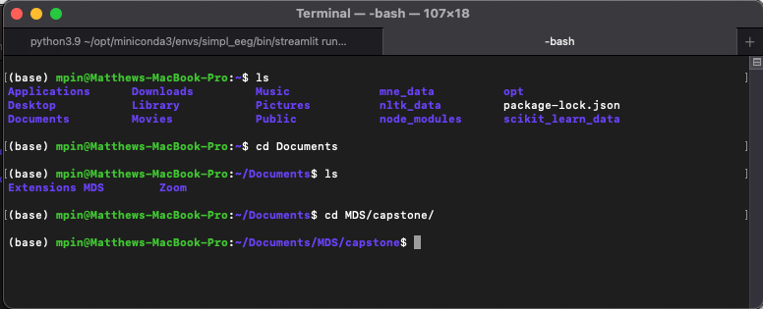
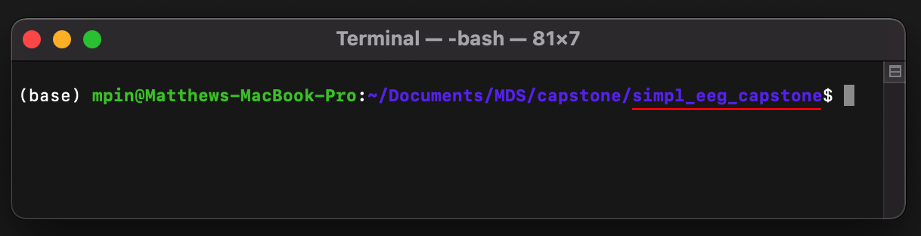
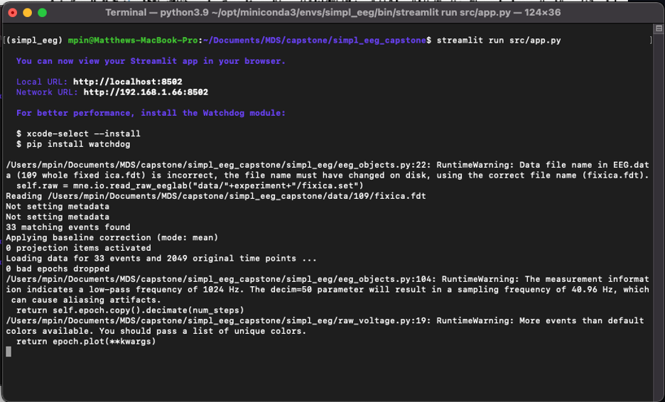
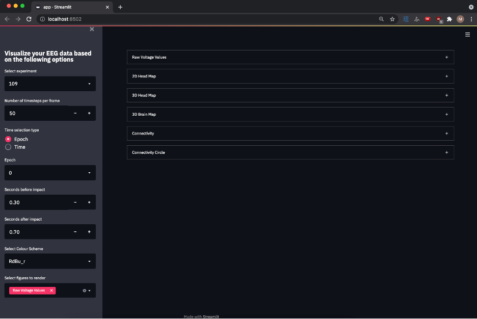
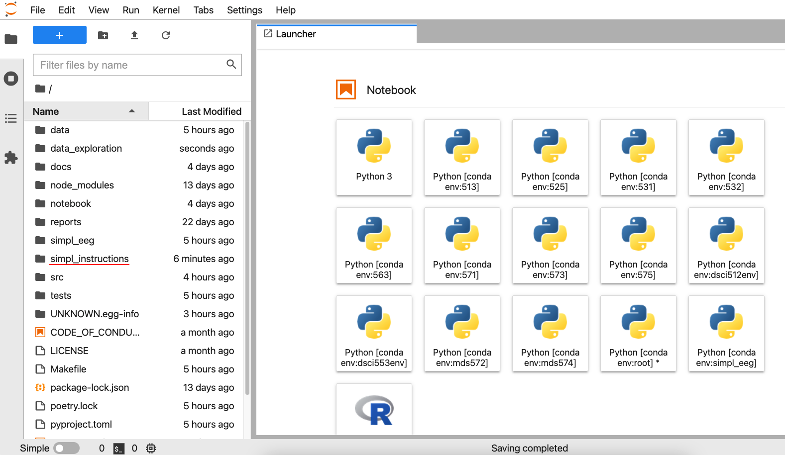
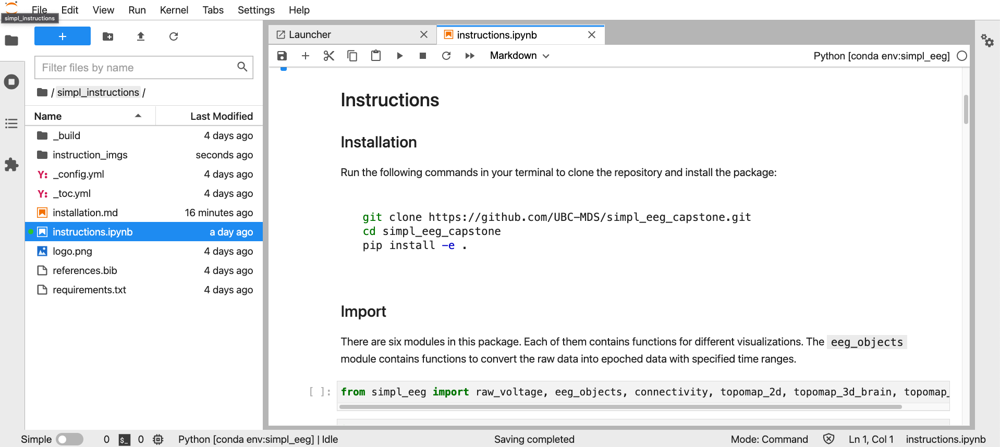

# simple\_eeg\_capstone visualization tools install guide

### **Pre-requisite computer setup**

If you have never used terminal before, please consult the following instructions in order to setup up the necessary tools. These instructions will continue to be update into the future so they should remain current.

<https://ubc-mds.github.io/resources_pages/installation_instructions/>

Please fully install the sections with the following headers...

-   Windows

    -   Git and Bash
    -   Python and Conda

-   Mac

    -   Bash shell
    -   Git
    -   Python and Conda

-   Ubuntu

    -   Git
    -   Python and Conda

### **Installing the simpl\_eeg package in a new environment**

Please open your Unix shell (i.e. terminal on a Mac, GitBash on Windows) and navigate to a folder you will use to store the files (if you've never used a terminal before please look at the following instructions <https://swcarpentry.github.io/shell-novice/02-filedir/index.html> to help you navigate). Some basic commands which might help include...

-   `ls` list all files/folders in your current directory

-   `cd` move to a different directory

    -   `cd/folder` moves you into that folder and makes it your current directory

    -   `cd..` moves you back out of the folder you are currently in

Then clone our repo using...

`git clone https://github.com/UBC-MDS/simpl_eeg_capstone.git`

And enter the root of the directory using...

`cd simpl_eeg_capstone`

After navigating to the root of the directory in terminal (i.e. being within the 'simpl\_eeg\_capstone' folder) Run the following commands...

`conda create –name simpl_eeg` (then press "y" to accept when prompted)

`conda activate simpl_eeg`

`conda install ipykernel` (then press "y" to accept)

`conda install nb_conda_kernels` (then press "y" to accept)

Finally, double check that you are in the simple\_eeg\_capstone directory and install the package contents using...

`pip install -e .`

### **To use the streamlit UI**

Navigate to the root of the directory and run the following command...

streamlit run src/app.py

This will cause the UI to open in your browser like such...

You can refresh the UI to restart it or open it in another window by copying the url (<http://localhost:8502/>).

## **To use the simple\_eeg\_capstone's visualization tools in JupyterLab**

Please complete the JuptyerLab setup section if you have not installed it yet (<https://ubc-mds.github.io/resources_pages/installation_instructions/>)

The instructions for how to use the package are in a JupyterNotebook stored in `simpl_eeg_capstone/simple_instructions/instructions.ipynb`. After installing JuptyerLab you should be able to open the program by typing...

`jupyter lab`

In the command line which will open a new tab in your browser.

